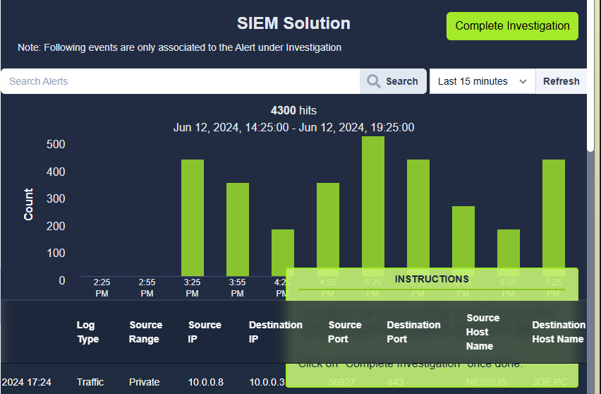
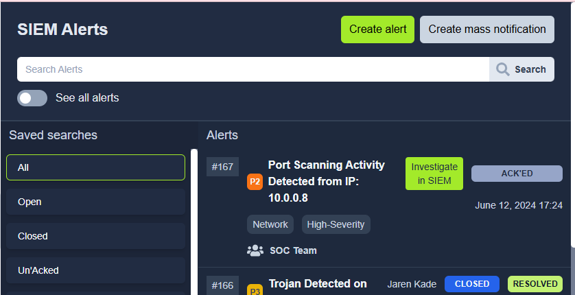
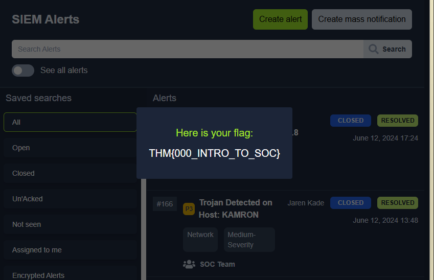

**Portfolio Project – SOC Analyst Practice Lab**  

# SOC Level 1 Alert Investigation Report  
## Port Scanning Activity Analysis

## Scenario

You are the Level 1 Analyst of your organization’s SOC team. You receive an alert that a port scanning activity has been observed on one of the hosts in the network. You have access to the SIEM solution, where you can see all the associated logs for this alert. You are tasked to view the logs individually and answer the question to the 5 Ws given below.

Note: The vulnerability assessment team notified the SOC team that they were running a port scan activity inside the network from the host: 10.0.0.8

## Solution

Using the organization's **SIEM platform**, I investigated the alert logs to determine the full context of the activity and document the findings using the **5 Ws methodology**.

## Alert Summary

- **Alert Type:** Port Scanning Activity  
- **Source IP:** 10.0.0.8  
- **Destination IP:** 10.0.0.3  
- **Date/Time:** June 12, 2024 – 17:24  
- **Tool Identified:** Nessus Vulnerability Scanner  
- **Response Observed:** Yes (Target host responded)

## 5 Ws Analysis

| Question      | Finding 
|----------     |----------
| **What**      | Port scan detected 
| **Where**     | Destination IP: 10.0.0.3 
| **When**      | June 12, 2024 – 17:24 
| **Who**       | Nessus 
| **Why**       | Intended 

## Investigation Process

1. Reviewed SIEM alert details.
2. Correlated logs to identify source and destination IP addresses.
3. Verified scanning patterns consistent with vulnerability assessment activity.
4. Confirmed tool signature matched **Nessus**.
5. Cross-referenced notification from Vulnerability Assessment Team.
6. Determined activity was **authorized and intended**, not malicious.
7. Verified that the destination host responded to scan traffic.

## Evidence & Screenshots

Screenshots captured during investigation.

### SIEM Alert View

### Log Details View

### Nessus Scan Evidence

## Tools Used

- SIEM Platform (Log Analysis & Correlation)
- Nessus (Vulnerability Scanner)
- Network Log Inspection

## Key Analyst Takeaways

- Not all port scans are malicious - context and communication between teams is critical.
- Always validate alerts against internal change management or vulnerability schedules.
- Proper documentation strengthens SOC reporting and escalation processes.
- The 5 Ws framework provides structured and efficient alert analysis.

## Skills Demonstrated

- SIEM log analysis  
- Alert triage & investigation  
- Network traffic interpretation  
- Identifying authorized vs malicious activity  
- Security documentation & reporting  

